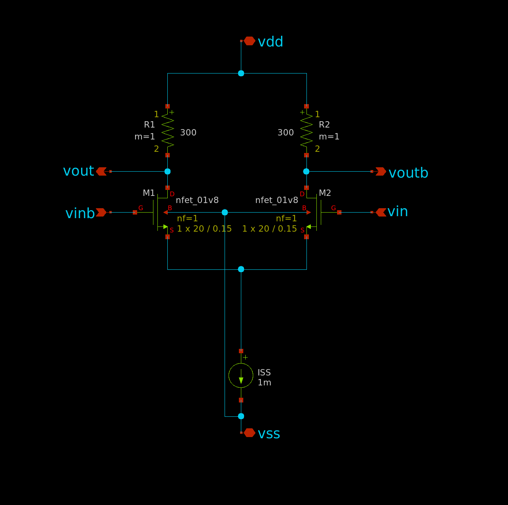

# SKY130 CML CELLS

This repository contains CML logic cells and current sources for mixed-signal circuit design using the SKY130 process.
The long-term goal is to design a 12-bit DAC and do a characterization (max sample rate, ENOB, INL, DNL, etc.).

## About CML

Current mode logic (CML) is a logic family operating on differential voltage signals. This makes CML a very fast logic family often used for high-speed digital to analog converters and other mixed-signal circuits.
The way CML achieves this is by "steering" a constant current between alternative branches in the circuit. Changing the flow of current is much faster than changing the voltage on a net, because no capacitors need to be charged or discharged.

## Design Notes

The cells are designed with the following goals/parameters in mind, which can be fine
tuned if needed:
* Supply voltage 1.8V
* Differential voltage swing 600 mV (maybe 400 mV if I feel like it idk)
* Drive strength (constant current) of 1 / 2 / 4 / 8 mA per logic cell. For logic function cells a lower constant current may be feasible, which would require higher load resistance, which would slow down the cells. TBD
* Minimize transistor dimensions (while still achieving other design goals)

At the moment the goal is to create a library of N-MOS CML cells. P-MOS is ignored for now.

P-MOS CML generally offers greater noise immmunity than N-MOS CML, because the P-MOS tranistors can be placed into deep-N-wells, which provides good isolation from substrate noise. On the other hand P-MOS transistors are generally slower than N-MOS transistors (of same size) due to lower mobility.

In the begining I will use ideal current sources when designing the CML cells to get going faster.
The different types of current sources (simple current mirror, cascode current mirror and cascode current mirror with low voltage drop) will then later be swapped in for the ideal current source.
